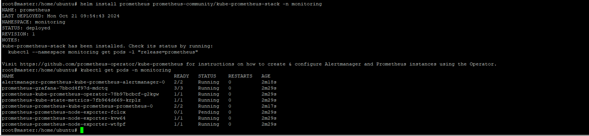
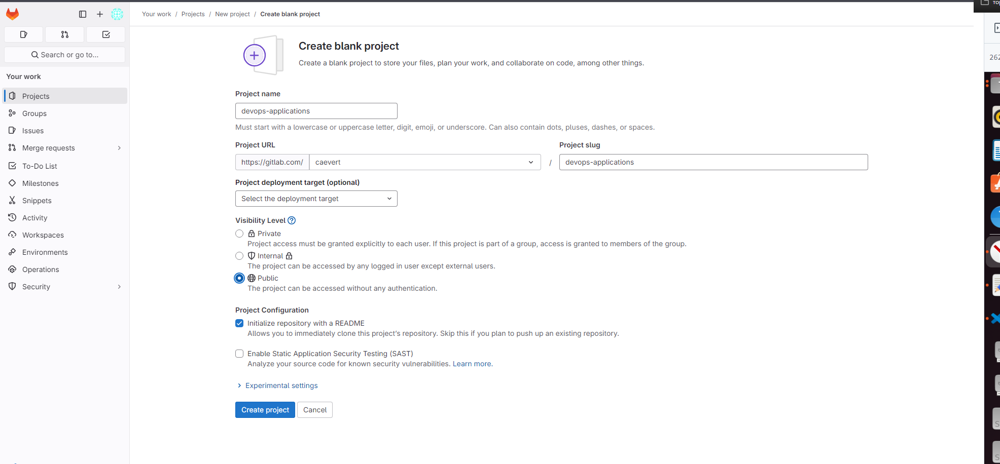

# Дипломный практикум в Yandex.Cloud - Антон Жандаров
  * [Цели:](#цели)
  * [Этапы выполнения:](#этапы-выполнения)
     * [Создание облачной инфраструктуры](#создание-облачной-инфраструктуры)
     * [Создание Kubernetes кластера](#создание-kubernetes-кластера)
     * [Создание тестового приложения](#создание-тестового-приложения)
     * [Подготовка cистемы мониторинга и деплой приложения](#подготовка-cистемы-мониторинга-и-деплой-приложения)
     * [Установка и настройка CI/CD](#установка-и-настройка-cicd)
  * [Что необходимо для сдачи задания?](#что-необходимо-для-сдачи-задания)
  * [Как правильно задавать вопросы дипломному руководителю?](#как-правильно-задавать-вопросы-дипломному-руководителю)

**Перед началом работы над дипломным заданием изучите [Инструкция по экономии облачных ресурсов](https://github.com/netology-code/devops-materials/blob/master/cloudwork.MD).**

---
## Цели:

1. Подготовить облачную инфраструктуру на базе облачного провайдера Яндекс.Облако.
2. Запустить и сконфигурировать Kubernetes кластер.
3. Установить и настроить систему мониторинга.
4. Настроить и автоматизировать сборку тестового приложения с использованием Docker-контейнеров.
5. Настроить CI для автоматической сборки и тестирования.
6. Настроить CD для автоматического развёртывания приложения.

---
## Этапы выполнения:


### Создание облачной инфраструктуры

Для начала необходимо подготовить облачную инфраструктуру в ЯО при помощи [Terraform](https://www.terraform.io/).

Особенности выполнения:

- Бюджет купона ограничен, что следует иметь в виду при проектировании инфраструктуры и использовании ресурсов;
Для облачного k8s используйте региональный мастер(неотказоустойчивый). Для self-hosted k8s минимизируйте ресурсы ВМ и долю ЦПУ. В обоих вариантах используйте прерываемые ВМ для worker nodes.

Предварительная подготовка к установке и запуску Kubernetes кластера.

Предварительная подготовка к установке и запуску Kubernetes кластера.

1. Создайте сервисный аккаунт, который будет в дальнейшем использоваться Terraform для работы с инфраструктурой с необходимыми и достаточными правами. Не стоит использовать права суперпользователя
2. Подготовьте [backend](https://www.terraform.io/docs/language/settings/backends/index.html) для Terraform:  
   а. Рекомендуемый вариант: S3 bucket в созданном ЯО аккаунте(создание бакета через TF)
   б. Альтернативный вариант:  [Terraform Cloud](https://app.terraform.io/)
3. Создайте конфигурацию Terrafrom, используя созданный бакет ранее как бекенд для хранения стейт файла. Конфигурации Terraform для создания сервисного аккаунта и бакета и основной инфраструктуры следует сохранить в разных папках.
4. Создайте VPC с подсетями в разных зонах доступности.
5. Убедитесь, что теперь вы можете выполнить команды `terraform destroy` и `terraform apply` без дополнительных ручных действий.
6. В случае использования [Terraform Cloud](https://app.terraform.io/) в качестве [backend](https://www.terraform.io/docs/language/settings/backends/index.html) убедитесь, что применение изменений успешно проходит, используя web-интерфейс Terraform cloud.
   Ожидаемые результаты:

1. Terraform сконфигурирован и создание инфраструктуры посредством Terraform возможно без дополнительных ручных действий.

[Конфигурация terraform](I.Terraform/)


VMS in YC
```
+----------------------+--------+---------------+---------+----------------+----------------+
|          ID          |  NAME  |    ZONE ID    | STATUS  |  EXTERNAL IP   |  INTERNAL IP   |
+----------------------+--------+---------------+---------+----------------+----------------+
| epdjehfpdpfalutkuep9 | slave2 | ru-central1-b | RUNNING | 158.160.12.225 | 192.168.200.14 |
| fhm2630o4n2btldi565o | slave1 | ru-central1-a | RUNNING | 89.169.143.31  | 192.168.100.20 |
| fv485411t4bqp5mff2dt | master | ru-central1-d | RUNNING | 84.252.135.85  | 192.168.10.100 | 
```
2. Полученная конфигурация инфраструктуры является предварительной, поэтому в ходе дальнейшего выполнения задания возможны изменения.

---
## Этап второй - Создание Kubernetes кластера

На данном этапе необходимо развернуть `Kubernetes` кластер, для данной задачи будем использовать набор конфигураций _Ansible_ [`Kubespray`](https://github.com/kubernetes-sigs/kubespray)

1. Клонирем `kubespray` командой `git clone https://github.com/kubernetes-sigs/kubespray`
2. Создаем конфигурацию своего кластера:

```shell
cd kubespray
cp inventory/sample inventory/netology
```

3. Выясняем айпи машин кластера на которые будет производится установка:


4. Для установки необходимо указать конфигурацию кластера.

```shell
nano inventory/netology/hosts.yaml
all:
  hosts:
    master:
      ansible_host: 84.252.135.85
      ip: 192.168.10.100 
      ansible_user: ubuntu
      kubeconfig_localhost: true
    worker1:
      ansible_host: 89.169.143.31
      ip: 192.168.100.20
      ansible_user: ubuntu
    worker2:
      ansible_host: 158.160.12.225
      ip: 192.168.200.14
      ansible_user: ubuntu
  children:
    kube_control_plane:
      hosts:
        master:
    kube_node:
      hosts:
        master:
        worker1:
        worker2:
    etcd:
      hosts:
        master:
        worker1:
        worker2:
    k8s_cluster:
      children:
        kube_control_plane:
        kube_node:
    calico_rr:
      hosts: {}


```

5. Также необходимо предусмотреть генерацию сертификата для работы `kubectl`, укажем адрес управляющей ноды:

```shell
nano inventory/netology/group_vars/k8s_cluster/k8s-cluster.yml

supplementary_addresses_in_ssl_keys: [84.252.135.85]
```

6. После развертывания кластера скопируем локально в `.kube/config` файл конфигурации кластера Кубернетес `.kube/config` с управляющей ноды
```
piVersion: v1
clusters:
- cluster:
    certificate-authority-data: LS0tLS1CRUdJTiBDRVJUSUZJQ0FURS0tLS0tCk1JSURCVENDQWUyZ0F3SUJBZ0lJQXhGOW9nZ1dCZVV3RFFZSktvWklodmNOQVFFTEJRQXdGVEVUTUJFR0ExVUUKQXhNS2EzVmlaWEp1WlhSbGN6QWVGdzB5TkRFd01UWXhNVEE1TWpaYUZ3MHpOREV3TVRReE1URTBNalphTUJVeApFekFSQmdOVkJBTVRDbXQxWW1WeWJtVjBaWE13Z2dFaU1BMEdDU3FHU0liM0RRRUJBUVVBQTRJQkR3QXdnZ0VLCkFvSUJBUURXMHBFcWNZL2FEM3hqYXFaVUFRTHA3STZKeVVRMXlORjlqTzF0TVg4cWR3MkNKL1JINGI4cmhlNUoKSlJNbEJSNnIxMEhId3RrLzFmbFh2RHNmdGoyUHBDVVU3aE4zZmtlVWd6cE5BY2xSOHg2eGxJUmorZEkvZFdRMworcDN2R1FhamdXeHRSY0F4YXJ5dVdsby9TMWpSZHUzajNwQTJ0RlNCaWhhWDBTci9BTHgxZ0YrWitzYUdnWnBRCnBVdkVNTGFjRHhLb1FpdlJRYmxteXFwNmd3YWFjbEJ3ZSthYWxpQkFqZlZhUWZPSWlmZWx5ZXQ3NlVBeW9EYXEKNmhXd1c4VFVRdHlKalh4ZUkwUDFVblNjc29HVVBkakN1RGxvQUJkUWhBTGZhT3hSQktyVFFQcUNXaFAwL1c5OQpGYUtuRjlvaUpjd2gwWlpvY3laVEtyV1h6dDlkQWdNQkFBR2pXVEJYTUE0R0ExVWREd0VCL3dRRUF3SUNwREFQCkJnTlZIUk1CQWY4RUJUQURBUUgvTUIwR0ExVWREZ1FXQkJSMjc0Y1FZdmhCZ1BlMU96R25vamxwYUNQdHVqQVYKQmdOVkhSRUVEakFNZ2dwcmRXSmxjbTVsZEdWek1BMEdDU3FHU0liM0RRRUJDd1VBQTRJQkFRQzM4YzE1WVViNgpLaEpESmthc1o5dlNySko5NWl5dEhpczdLMmRPb0htQXR2cW5PVmdoMUtnQk9yUzJtLy9GMjdMdzhsZ2JDd1JuCitDb0JvVWFKYVBmVVM0c3RMdnJrVUZWMWRERi8zT285UmcxSzNCNzdaSjVQZldkSUZzZUtXNnJIRjJDVE9vdncKT01vT2xiL3VLcFdFRXBaRncyeFd5MkYrd05WZ0N4RnB6eE9JUVpJR09XeDVleTlpRmRVdkFkbmJ1MXpiNEVEOApPcGNBMTZtcTdYcUZCKzBYTUU3SHNyVTlmMVJxWDR2Sy93V2IvT3pFLzhyRDZBUXd0bnQvclBoVk5nbXBURnhzCklkZ2ZQUEl4czErZjRIZjZtUHJ0T1Jublg4NWNvSFhsenZpQm8yZHNSanZTOHhqVzRObVhwVnV4RkJ5a2pFcUYKcDFnWW1oY2dqRkJiCi0tLS0tRU5EIENFUlRJRklDQVRFLS0tLS0K
    server: https://192.168.10.100:6443
  name: cluster.local
contexts:
- context:
    cluster: cluster.local
    user: kubernetes-admin
  name: kubernetes-admin@cluster.local
current-context: kubernetes-admin@cluster.local
kind: Config
preferences: {}
users:
- name: kubernetes-admin
  user:
    client-certificate-data: LS0tLS1CRUdJTiBDRVJUSUZJQ0FURS0tLS0tCk1JSURLVENDQWhHZ0F3SUJBZ0lJQUtlUXlraGNwSWt3RFFZSktvWklodmNOQVFFTEJRQXdGVEVUTUJFR0ExVUUKQXhNS2EzVmlaWEp1WlhSbGN6QWVGdzB5TkRFd01UWXhNVEE1TWpaYUZ3MHlOVEV3TVRZeE1URTBNalphTUR3eApIekFkQmdOVkJBb1RGbXQxWW1WaFpHMDZZMngxYzNSbGNpMWhaRzFwYm5NeEdUQVhCZ05WQkFNVEVHdDFZbVZ5CmJtVjBaWE10WVdSdGFXNHdnZ0VpTUEwR0NTcUdTSWIzRFFFQkFRVUFBNElCRHdBd2dnRUtBb0lCQVFEcHBTdFYKT1dlRGhzRi9LekJBeXpTUG13dFRGWVFhZmROdG13Mmt0dFRTamZjeVdmcjJraTBkT2xIKzNOTmFsYjVNQWJOUQpFZjkvM3U3OXc1d2RZeTMrdUlpRXQvaFJ0V0dpdG42akxQVDF1SmdhQkN5T1JZR1dIUmtYeVJlSjlJNTEvbEVlClRjTDBZM2dJZFBzYXZ1RCtHWjg3RERxVXlOT0lCK0twM3VET0JHY2QxV3FRaHVIaVdGMHhiL2VBckZOZElKRWQKcXpnQ3F0eUZYQXJDbnZydkg2OTd1U015N3RLempGZFBtaTcvVnprelpyTi8vVGRoUFdoRXVKcG9EYmtmQWFINwp0TXczNlBxUXozb3ZnMGxiL2NPYW5ld2tENkFFeklWWmxzUlZKbFFlOUpmMy9WOUt2bVdSWDErbkNyOU10bmhBClVKcERKdHIzbDd2QXBZRWZBZ01CQUFHalZqQlVNQTRHQTFVZER3RUIvd1FFQXdJRm9EQVRCZ05WSFNVRUREQUsKQmdnckJnRUZCUWNEQWpBTUJnTlZIUk1CQWY4RUFqQUFNQjhHQTFVZEl3UVlNQmFBRkhidmh4QmkrRUdBOTdVNwpNYWVpT1dsb0krMjZNQTBHQ1NxR1NJYjNEUUVCQ3dVQUE0SUJBUUNYaEM0WUhpaDMzT3ZuOE9MQ0U3Ym5JdlhFCkNSOE1JQWttQlZPUnlMVmlxSmxpWnQzRG5rQVlkRXZHS1NVKzI4Z0JyNURRT2ZrelJ2TVFITTRRMUtzaEN0K3oKdzFqcHhhTjA2dUQ1a0lRNHpQeHRsTys0Y2psd3VTVHBoWlRWU1pJKzRPc05UQ21mYm9ld0RibHowUm1USktucgpQUEtWS2hIcEpjN0Z0YkFET1VQRUxHdTQzNHRGS08wWUVrL1NBL3V6clJ5U0t0OFBZZE9XRjVQbHRJZmNmOGVUCkM2ZFdYaFlkZGIxMk9jMGk2QXNMRXhpWjRXOWpoVFp3MnV6NmxTejNvNlNpeE0rWFB0RDBsODAvcjErV3h2UU4KUm1INVhwazdqT2RUNGFjemdERkZqaFp0cjJUN1BCMy9BWi83aTZTOXh2T0U1R05LL0dVTUFNUWtSQ0RpCi0tLS0tRU5EIENFUlRJRklDQVRFLS0tLS0K
    client-key-data: LS0tLS1CRUdJTiBSU0EgUFJJVkFURSBLRVktLS0tLQpNSUlFcEFJQkFBS0NBUUVBNmFVclZUbG5nNGJCZnlzd1FNczBqNXNMVXhXRUduM1RiWnNOcExiVTBvMzNNbG42CjlwSXRIVHBSL3R6VFdwVytUQUd6VUJIL2Y5N3UvY09jSFdNdC9yaUloTGY0VWJWaG9yWitveXowOWJpWUdnUXMKamtXQmxoMFpGOGtYaWZTT2RmNVJIazNDOUdONENIVDdHcjdnL2htZk93dzZsTWpUaUFmaXFkN2d6Z1JuSGRWcQprSWJoNGxoZE1XLzNnS3hUWFNDUkhhczRBcXJjaFZ3S3dwNzY3eCt2ZTdrak11N1NzNHhYVDVvdS8xYzVNMmF6CmYvMDNZVDFvUkxpYWFBMjVId0doKzdUTU4rajZrTTk2TDROSlcvM0RtcDNzSkErZ0JNeUZXWmJFVlNaVUh2U1gKOS8xZlNyNWxrVjlmcHdxL1RMWjRRRkNhUXliYTk1ZTd3S1dCSHdJREFRQUJBb0lCQVFDNWZBS1d1ZWZQcHQ5ZQpVYThSQVVGTThFMWhQQ2VQMEd4VkMwOGRnSGdjWDgvckRUd0xHNmp0Rnl1WkpUNDFIOFBmRzBwN09vNlh1U2dLCkZZeU9WL3BmeWFlM2xVVnh1SWsyWDZMUmNCTllMNSt3cDdlbmlzNkJtY0FkL2VyTi9uUktnQWR1QTFYT0psbFkKZldZTHFaVjhwR0tnd2VpUHpZOEE0eUd5c2RuT01uUkpZWE9OZ1RWWFBMQnNtdng2a3FseWFmUENWOEN0RUZPagp4MlZqU29nejdBY1N0dTdnZ2lHZ2NseWNSblpQdHlEeCsySG1NMTdRSmlLWlRwNU8zYnJzYThZQVBnQW1PMnJ1CmhtOU1WZGZLRGxKUG5BdmRDeUtTR0VJSVNtZGU3S0pBU0FDRXlseUpKZElkOGpKZjBheFJTVTZlcC9mNFROcWQKNGdvL3BhcmhBb0dCQVBTNk5DYlJHRHI0dnRpOE92Nk1FVzh2VExpY00rbHhNSU9mQ2w4c3dYMHFzVGxraU9UWgpubXFRUzVBZm43MnJhdkNPbVZURDJZSEJIa093TDIxdTVCRFhscURHeVRWak9MbzBXUkdaWjY0cEZiZ3NmYjNKCmtZY2QwZGZnZXl5TTU4R0hSSDJ4OXdpTzdQTzRobWwyek1tcDdXYy8zSFZua0x2TjBjMXlTM3lUQW9HQkFQUm8KU1RRK1pTdk5IRG11UDFiamZIYWJDMVpqZEM2dURRTU1LL1JRMTRLeUFoNVErOWZQVnlDZkVodUh2bHlEZDRkVApGUWdncXR2WmgwMytSNWtkOHBsS1pYWlZIcG9zOFlLZXRGYUJRbURyKzV0QkxrYVlrdGY4Wmc5M01rNm9lbVkwCnJZVTRWUERuSlVyYjFtdlE3RnZFOXV6ZHlBM0tHdUZVVjJyZEFVekZBb0dBT0lDQkovRWdzZ1RhTXpvS09Oam4KOFk2dkhQUmJlK3M1TXpwVjc3RnFudFpyZ24rMnAzZWkvcUdBQUs5OGR4TUxwcXlWdEI5ZnFYaUgzMExmUUZuWQo2QmFPWFdKbjlCNkxhMXBJc2lxRDZJN3R4ODdsM1JxYnNlRnRvSFRnbTJHUTVIcXhrbit6TkZPalc0WGY2cHVXCkhuMVFKWVYyQmRrNmJsSFB2YXBFeVdjQ2dZQlplVFFUWkNRMWZNa3dkSkhMaFV3elAxOVBLT21IalVCR05WYUMKQW5aaTZqZk1VV2xoQUE2dGFvNStkWnRDMHY0WEZGdEd0bTdXUFRSRFlTdGs2b205aEhiUWN5alkyRXN4dmxmVwpzMHRSb0JKa0srQjlCNjM2VS9RcEJVSHRlZEFWU29PYm1adSs5Vis1bi9GSFZ4eXdHOU1wczZkaEpQUGlPYlltCjhQRmc0UUtCZ1FEUUxUWUUwaXpwMFdZUXRnalFwL1d5bkJwSm5DZER0SjBlanR4NDVNYVN0OWduclBiRVFhYzgKVlp2SDE1RklkQlAzb0c4dlhaUThSRGFNWGFXemMxK3d4OEVBTUljV0d6bWlhcmxHcVRSL28wRmxaMU16WGptaQpWVnFpQVUxTjExZDhwMmtSRkR3c3Brd2VZODluTDIxUmJTQ0FzRnRwS3Zsc2hYd1p2emI2U3c9PQotLS0tLUVORCBSU0EgUFJJVkFURSBLRVktLS0tLQo=

```
7. Команда `kubectl get pods --all-namespaces` отрабатывает без ошибок


## Итог: кластер `Kubernetes` запущен и работает на инстансах YandexCloud подготовленных при помощи `Terraform`
---


### Этап третий - подготовка тестового приложения

1. Создаем [`Dockerfile`](III.Application/Dockerfile) с простой конфигураций сервера `nginx` отдающим статическую страницу c именем хоста(контейнера) и версией сборки(тэгом).

```
# Pull the minimal Ubuntu image
FROM nginx

# Copy the Nginx config
COPY default.conf /etc/nginx/conf.d/

# Expose the port for access
EXPOSE 80/tcp

# Run the Nginx server
CMD ["/usr/sbin/nginx", "-g", "daemon off;"]
```

2. Также добавляем в репозиторий файл конфигурации [`default.conf`](III.Application/default.conf) и файл [`index.html`](III.Application/index.html)

3. Далее следует собрать образ и отправить его в registry DockerHub

```shell
$ cd docker
$ docker build -t caevert24/nmynginx .

Sending build context to Docker daemon  4.096kB
Step 1/4 : FROM nginx
alpine: Pulling from library/nginx
63b65145d645: Pull complete
51f129e7c3f1: Pull complete
f32490ce40c5: Pull complete
d18f1b67600c: Pull complete
b793aaf052d0: Pull complete
10b0102e5979: Pull complete
ec50f2776186: Pull complete
Digest: sha256:ff07dba791a114f5d944c8455e8236ca4b184bfd8d21d90b7755a4ba0a119b06
Status: Downloaded newer image for nginx
 ---> fddf8c2fcb06
Step 2/4 : COPY default.conf /etc/nginx/conf.d/
 ---> 76d6eac0e768
Step 3/4 : COPY index.html /usr/share/nginx/html/
 ---> 9d9f6ac461fe
Step 4/4 : CMD ["nginx", "-g", "daemon off;"]
 ---> Running in 9bea7252bf6f
Removing intermediate container 9bea7252bf6f
 ---> 4f80752a2eb2
Successfully built 4f80752a2eb2
Successfully tagged caevert24/nmynginx
```


3.1 Проверим, что образ загрузился на DockerHub


4. Запустим контейнер и проверим его работу

```shell
$ docker run -d --rm -p 80:80 --name nginx caevert24/nmynginx
ff07dba791a114f5d944c8455e8236ca4b184bfd8d21d90b7755a4ba0a119b06
```

5. Проверим работу сервера
```shell
$ curl localhost

<!DOCTYPE html>
<html>
<head>
<title>Welcome to nginx!</title>
<style>
    body {
        width: 35em;
        margin: 0 auto;
        font-family: Tahoma, Verdana, Arial, sans-serif;
    }
</style>
</head>
<body>
<h1>Welcome to nginx!</h1>
<p>If you see this page, the nginx web server is successfully installed and
working. Further configuration is required.</p>

<p>For online documentation and support please refer to
<a href="http://nginx.org/">nginx.org</a>.<br/>
Commercial support is available at
<a href="http://nginx.com/">nginx.com</a>.</p>

<p><em>Thank you for using nginx.</em></p>
</body>
</html>
```

---
### Подготовка cистемы мониторинга и деплой приложения

Уже должны быть готовы конфигурации для автоматического создания облачной инфраструктуры и поднятия Kubernetes кластера.  
Теперь необходимо подготовить конфигурационные файлы для настройки нашего Kubernetes кластера.

Цель:
1. Задеплоить в кластер [prometheus](https://prometheus.io/), [grafana](https://grafana.com/), [alertmanager](https://github.com/prometheus/alertmanager), [экспортер](https://github.com/prometheus/node_exporter) основных метрик Kubernetes.

Выполним установку вышеуказанных мониторингов через `helm`. Сначала установим `helm` на `control-plane` ноду
```
curl https://raw.githubusercontent.com/helm/helm/master/scripts/get-helm-3 | bash
```
Создаем отдельное простанство имен для мониторинга
```
kubectl create namespace monitoring
```
Добавляем репозиторий `helm` c `prometheus`
```
helm repo add prometheus-community https://prometheus-community.github.io/helm-charts
```
Устанавливаем `kube-prometheus-stack` (установка `Prometheus`, `Grafana`, `Alertmanager`, `node-exporter` и `kube-state-metrics`)
```
helm install prometheus prometheus-community/kube-prometheus-stack -n monitoring
```
Проверяем, что все поры работают нормально
```
kubectl get pods -n monitoring
```



Получаем пароль от `Grafana`
```
kubectl get secret -n monitoring prometheus-grafana -o jsonpath="{.data.admin-password}" | base64 --decode ; echo
```
Настраиваем доступ к `Grafana` по внешнему ip адресу, для чего создаем файл values.yml
```yml
grafana:
  service:
    type: NodePort
    nodePort: 32000 
```
Обновляем `helm` чарт
```
helm upgrade prometheus prometheus-community/kube-prometheus-stack -n monitoring -f values.yml
```


2. Задеплоить тестовое приложение, например, [nginx](https://www.nginx.com/) сервер отдающий статическую страницу.

Cоздаем деплой `nginx-deployment.yml`, куда прописываем следующую конфигурацию
```yml
apiVersion: apps/v1
kind: Deployment
metadata:
  name: nmynginx
  labels:
    app: nmynginx
spec:
  replicas: 3
  selector:
    matchLabels:
      app: nmynginx
  template:
    metadata:
      labels:
        app: nmynginx
    spec:
      containers:
        - name: nginx
          image: caevert24/nmynginx
          ports:
            - containerPort: 80
```
Также нам необходим сервис `nginx-service.yml`
```yml
piVersion: v1
kind: Service
metadata:
  name: nmynginx
  labels:
    app: nmynginx
spec:
  type: NodePort
  ports:
    - port: 80
      targetPort: 80
      nodePort: 32001
  selector:
    app: nmynginx
```

Применяем изменения и проверяем результат
```
kubectl apply -f nginx-deployment.yml
kubectl apply -f nginx-service.yml
kubectl get pods -l app=nginx-static
```


Способ выполнения:
1. Воспользоваться пакетом [kube-prometheus](https://github.com/prometheus-operator/kube-prometheus), который уже включает в себя [Kubernetes оператор](https://operatorhub.io/) для [grafana](https://grafana.com/), [prometheus](https://prometheus.io/), [alertmanager](https://github.com/prometheus/alertmanager) и [node_exporter](https://github.com/prometheus/node_exporter). Альтернативный вариант - использовать набор helm чартов от [bitnami](https://github.com/bitnami/charts/tree/main/bitnami).

2. Если на первом этапе вы не воспользовались [Terraform Cloud](https://app.terraform.io/), то задеплойте и настройте в кластере [atlantis](https://www.runatlantis.io/) для отслеживания изменений инфраструктуры. Альтернативный вариант 3 задания: вместо Terraform Cloud или atlantis настройте на автоматический запуск и применение конфигурации terraform из вашего git-репозитория в выбранной вами CI-CD системе при любом комите в main ветку. Предоставьте скриншоты работы пайплайна из CI/CD системы.

Ожидаемый результат:
1. [Git репозиторий](https://github.com/caevert/devops-diplom-ycloud/tree/main/IV.Monitoring) с конфигурационными файлами для настройки Kubernetes (в качестве конфигурационных файлов представлены деплой [nginx-deployment.yml](https://github.com/caevert/devops-diplom-ycloud/tree/main/IV.Monitoring/nginx-deployment.yml) и сервис [nginx-service.yml](https://github.com/caevert/devops-diplom-ycloud/tree/main/IV.Monitoring/nginx-service.yml) для развертывания нашей тестовой страницы).
2. [Http доступ к web интерфейсу grafana](http://84.252.133.212:32000/login).
3. [Дашборды в grafana отображающие состояние Kubernetes кластера](http://84.252.133.212:32000/dashboards) .
4. [Http доступ ктестовому приложению](http://84.252.133.212:32001/).
   
---

### Установка и настройка CI/CD

Осталось настроить ci/cd систему для автоматической сборки docker image и деплоя приложения при изменении кода.

Цель:

1. Автоматическая сборка docker образа при коммите в репозиторий с тестовым приложением.
2. Автоматический деплой нового docker образа.

Можно использовать [teamcity](https://www.jetbrains.com/ru-ru/teamcity/), [jenkins](https://www.jenkins.io/), [GitLab CI](https://about.gitlab.com/stages-devops-lifecycle/continuous-integration/) или GitHub Actions.

Ожидаемый результат:

1. Интерфейс ci/cd сервиса доступен по http.
2. При любом коммите в репозиторие с тестовым приложением происходит сборка и отправка в регистр Docker образа.
3. При создании тега (например, v1.0.0) происходит сборка и отправка с соответствующим label в регистри, а также деплой соответствующего Docker образа в кластер Kubernetes.


## Выполнение задания:

Выполняем настройку ci/cd системы для автоматической сборки docker image и деплоя приложения при изменении кода.

1. Для организации процессов CI/CD воспользуемся функционалом GitLab, создаем репозиторий и отправляем наше приложение в этот репозиторий:



2. Заливаем приложение в созданный репозиторий GitLab:

```
root@ubn-serv:~/devops-application$ git remote add diplom https://gitlab.com/caevert/devops-application.git
root@ubn-serv:~/devops-application$ git branch -M main
root@ubn-serv:~/devops-application$ git remote -v
diplom  https://gitlab.com/caevert/devops-application.git (fetch)
diplom  https://gitlab.com/caevert/devops-application.git (push)
origin  https://github.com/caevert/devops-application.git (fetch)
origin  https://github.com/caevert/devops-application.git (push)
root@ubn-serv:~/devops-application$ git push -f diplom 
Username for 'https://gitlab.com': caevert
Password for 'https://caevert@gitlab.com': 
Перечисление объектов: 156, готово.
Подсчет объектов: 100% (156/156), готово.
При сжатии изменений используется до 4 потоков
Сжатие объектов: 100% (134/134), готово.
Запись объектов: 100% (156/156), 1.26 МиБ | 2.63 МиБ/с, готово.
Всего 156 (изменений 35), повторно использовано 3 (изменений 0), повторно использовано пакетов 0
remote: Resolving deltas: 100% (35/35), done.
To https://gitlab.com/caevert/devops-application.git
 + fae3cab...4972e8c main -> main (forced update)
```

3. Проверяем результат на GitLab:


4. Для автоматизации процесса CI/CD создаем GitLab Runner, который будет выполнять задачи, указанные в файле .gitlab-ci.yml

5. На странице настроек проекта в разделе подключения GitLab Runner создаем Runner. Указанные на странице данные понадобятся для регистрации и аутентификации Runner'а в проекте.


6. Выполняем подготовку Kubernetes кластера к установке GitLab Runner'а. Создаем отдельный Namespace, в котором будет располагаться GitLab Runner и создаем Kubernetes secret, который будет использоваться для регистрации установленного в дальнейшем GitLab Runner:

```
ubuntu@master:~$ kubectl create namespace gitlab-runner
namespace/gitlab-runner created
ubuntu@master:~$ kubectl --namespace=gitlab-runner create secret generic runner-secret --from-literal=runner-registration-token="glrt-8G79CdQFjRbJKAHvoZs_" --from-literal=runner-token=""
secret/runner-secret created
```

Также понадобится подготовить файл значений values.yaml, для того, чтобы указать в нем количество Runners, время проверки наличия новых задач, настройка логирования, набор правил для доступа к ресурсам Kubernetes, ограничения на ресурсы процессора и памяти.


Загружаем Runner из репозитория на ноду master

```
ubuntu@master:~$ git remote add origin https://github.com/caevert/devops-application.git
ubuntu@master:~$ git remote -v
origin  https://github.com/caevert/devops-application.git (fetch)
origin  https://github.com/caevert/devops-application.git (push)
ubuntu@master:~$ git pull origin main
remote: Enumerating objects: 160, done.
remote: Counting objects: 100% (160/160), done.
remote: Compressing objects: 100% (117/117), done.
remote: Total 160 (delta 36), reused 141 (delta 20), pack-reused 0 (from 0)
Receiving objects: 100% (160/160), 1.26 MiB | 5.43 MiB/s, done.
Resolving deltas: 100% (36/36), done.
From https://github.com/caevert/devops-application
 * branch            main       -> FETCH_HEAD
 * [new branch]      main       -> origin/main
```

Приступаем к установке GitLab Runner. Устанавливать будем используя Helm:

```
ubuntu@master:~$ helm repo add gitlab https://charts.gitlab.io
"gitlab" has been added to your repositories
ubuntu@master:~$ helm install gitlab-runner gitlab/gitlab-runner -n gitlab-runner -f helm-runner/values.yaml
NAME: gitlab-runner
LAST DEPLOYED: Fri Oct  25 09:29:03 2024
NAMESPACE: gitlab-runner
STATUS: deployed
REVISION: 1
TEST SUITE: None
NOTES:
Your GitLab Runner should now be registered against the GitLab instance reachable at: "https://gitlab.com"

#############################################################################################
## WARNING: You enabled `rbac` without specifying if a service account should be created.  ##
## Please set `serviceAccount.create` to either `true` or `false`.                         ##
## For backwards compatibility a service account will be created.                          ##
#############################################################################################
```
Проверяем результат установки:

```
ubuntu@master:~$ helm list -n gitlab-runner
NAME            NAMESPACE       REVISION        UPDATED                                 STATUS          CHART                   APP VERSION
gitlab-runner   gitlab-runner   1               2024-10-25 09:29:03.408118155 +0000 UTC deployed        gitlab-runner-0.69.0    17.4.0     
ubuntu@control:~$ kubectl -n gitlab-runner get pods
NAME                             READY   STATUS    RESTARTS   AGE
gitlab-runner-7854c6cb4d-kq7bq   1/1     Running   0          8m20s
```

GitLab Runner установлен и запущен. Также можно через web-интерфейс проверить, подключился ли GitLab Runner к GitLab репозиторию:


Для выполнения GitLab CI/CD необходимо написать код выполнения Pipeline `.gitlab-ci.yml` для автоматической сборки docker image и деплоя приложения при изменении кода:

<details>

```
stages:
  - build
  - push
  - deploy
variables:
  IMAGE_NAME: "crud"
  DOCKER_IMAGE_TAG: $DOCKER_REGISTRY_IMAGE:$CI_COMMIT_SHORT_SHA
  DOCKER_REGISTRY_IMAGE: $DOCKER_REGISTRY_USER/$IMAGE_NAME
image: docker:latest
services:
- docker:dind
before_script:
  - docker login -u $DOCKER_REGISTRY_USER -p $DOCKER_ACCESS_TOKEN

Build:
  stage: build
  script:
    - docker pull $DOCKER_REGISTRY_IMAGE:latest || true
    - >
      docker build
      --pull
      --cache-from $DOCKER_REGISTRY_IMAGE:latest
      --label "org.opencontainers.image.title=$CI_PROJECT_TITLE"
      --label "org.opencontainers.image.url=$CI_PROJECT_URL"
      --label "org.opencontainers.image.created=$CI_JOB_STARTED_AT"
      --label "org.opencontainers.image.revision=$CI_COMMIT_SHA"
      --label "org.opencontainers.image.version=$CI_COMMIT_REF_NAME"
      --tag $DOCKER_IMAGE_TAG
      .

    - docker push $DOCKER_IMAGE_TAG

Push latest:
  variables:
    # We are just playing with Docker here.
    # We do not need GitLab to clone the source code.
    GIT_STRATEGY: none
  stage: push
  only:
    # Only "main" should be tagged "latest"
    - main
  script:
    # Because we have no guarantee that this job will be picked up by the same runner
    # that built the image in the previous step, we pull it again locally
    - docker pull $DOCKER_IMAGE_TAG
    # Then we tag it "latest"
    - docker tag $DOCKER_IMAGE_TAG $DOCKER_REGISTRY_IMAGE:latest
    # Annnd we push it.
    - docker push $DOCKER_REGISTRY_IMAGE:latest

Push tag:
  variables:
    # Again, we do not need the source code here. Just playing with Docker.
    GIT_STRATEGY: none
  stage: push
  only:
    # We want this job to be run on tags only.
    - main
  script:
    if [ $CI_COMMIT_TAG == "true" ]; then
    - docker pull $DOCKER_IMAGE_TAG
    - docker tag $DOCKER_IMAGE_TAG $DOCKER_REGISTRY_IMAGE:$CI_COMMIT_TAG
    - docker push $DOCKER_REGISTRY_IMAGE:$CI_COMMIT_TAG ; fi

Deploy:
  stage: deploy
  image:
    name: bitnami/kubectl:latest
    entrypoint: [""] 
  only:
    - main
  when: manual
  script:
    - kubectl apply -f k8s/deployment.yaml -n application
```

</details>

На первой стадии (build) происходит авторизация в Docker Hub, сборка образа и его публикация в реестре Docker Hub. Сборка образа будет происходить только для main ветки. Docker образ собирается с тегом latest'.

На второй стадии (deploy) будет применяется конфигурационный файл для доступа к кластеру Kubernetes и манифест из git репозитория. Затем перезапускается Deployment для применения обновленного приложения. Эта стадия выполняется только для ветки main и только при условии, что первая стадия build была выполнена успешно.

---
## Что необходимо для сдачи задания?

1. Репозиторий с конфигурационными файлами Terraform и готовность продемонстрировать создание всех ресурсов с нуля.
   [Конфигурация terraform](I.Terraform/)
2. Пример pull request с комментариями созданными atlantis'ом или снимки экрана из Terraform Cloud или вашего CI-CD-terraform pipeline.
 Для выполнения GitLab CI/CD необходимо написать код выполнения Pipeline `.gitlab-ci.yml` для автоматической сборки docker image и деплоя приложения при изменении кода:

<details>

```
stages:
  - build
  - push
  - deploy
variables:
  IMAGE_NAME: "crud"
  DOCKER_IMAGE_TAG: $DOCKER_REGISTRY_IMAGE:$CI_COMMIT_SHORT_SHA
  DOCKER_REGISTRY_IMAGE: $DOCKER_REGISTRY_USER/$IMAGE_NAME
image: docker:latest
services:
- docker:dind
before_script:
  - docker login -u $DOCKER_REGISTRY_USER -p $DOCKER_ACCESS_TOKEN

Build:
  stage: build
  script:
    - docker pull $DOCKER_REGISTRY_IMAGE:latest || true
    - >
      docker build
      --pull
      --cache-from $DOCKER_REGISTRY_IMAGE:latest
      --label "org.opencontainers.image.title=$CI_PROJECT_TITLE"
      --label "org.opencontainers.image.url=$CI_PROJECT_URL"
      --label "org.opencontainers.image.created=$CI_JOB_STARTED_AT"
      --label "org.opencontainers.image.revision=$CI_COMMIT_SHA"
      --label "org.opencontainers.image.version=$CI_COMMIT_REF_NAME"
      --tag $DOCKER_IMAGE_TAG
      .

    - docker push $DOCKER_IMAGE_TAG

Push latest:
  variables:
    # We are just playing with Docker here.
    # We do not need GitLab to clone the source code.
    GIT_STRATEGY: none
  stage: push
  only:
    # Only "main" should be tagged "latest"
    - main
  script:
    # Because we have no guarantee that this job will be picked up by the same runner
    # that built the image in the previous step, we pull it again locally
    - docker pull $DOCKER_IMAGE_TAG
    # Then we tag it "latest"
    - docker tag $DOCKER_IMAGE_TAG $DOCKER_REGISTRY_IMAGE:latest
    # Annnd we push it.
    - docker push $DOCKER_REGISTRY_IMAGE:latest

Push tag:
  variables:
    # Again, we do not need the source code here. Just playing with Docker.
    GIT_STRATEGY: none
  stage: push
  only:
    # We want this job to be run on tags only.
    - main
  script:
    if [ $CI_COMMIT_TAG == "true" ]; then
    - docker pull $DOCKER_IMAGE_TAG
    - docker tag $DOCKER_IMAGE_TAG $DOCKER_REGISTRY_IMAGE:$CI_COMMIT_TAG
    - docker push $DOCKER_REGISTRY_IMAGE:$CI_COMMIT_TAG ; fi

Deploy:
  stage: deploy
  image:
    name: bitnami/kubectl:latest
    entrypoint: [""] 
  only:
    - main
  when: manual
  script:
    - kubectl apply -f k8s/deployment.yaml -n application
```

</details>


На первой стадии (build) происходит авторизация в Docker Hub, сборка образа и его публикация в реестре Docker Hub. Сборка образа будет происходить только для main ветки. Docker образ собирается с тегом latest'.

На второй стадии (deploy) будет применяется конфигурационный файл для доступа к кластеру Kubernetes и манифест из git репозитория. Затем перезапускается Deployment для применения обновленного приложения. Эта стадия выполняется только для ветки main и только при условии, что первая стадия build была выполнена успешно.
```
3. Репозиторий с конфигурацией ansible, если был выбран способ создания Kubernetes кластера при помощи ansible.
4. Репозиторий с Dockerfile тестового приложения и ссылка на собранный docker image.
5. Репозиторий с конфигурацией Kubernetes кластера.
6. Ссылка на тестовое приложение и веб интерфейс Grafana с данными доступа.
7. Все репозитории рекомендуется хранить на одном ресурсе (github, gitlab)
